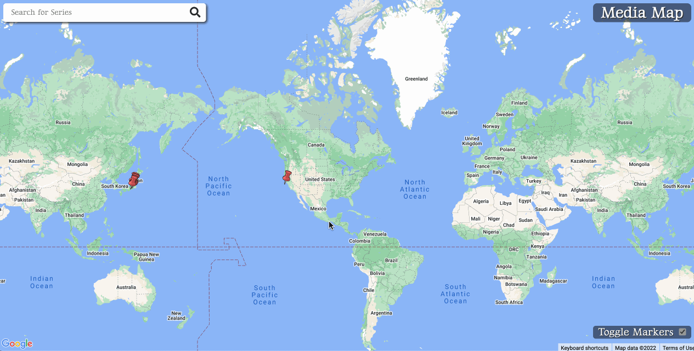

# Media Map Angular Client

Deployed on [Heroku](https://media-map-public-mw.herokuapp.com/)

Built for the purpose of learning Angular as well utilizing the Google Maps Javascript API at the request of a client. This repo in particular is the public facing website that is only concerned with READ operations. The primary user has access to a private React frontend website that allows them to interface with the other CRUD operations.

## Other related repositories

[Express API backend](https://github.com/MitchellWayne/map-museum/tree/main)

[Private React frontend](https://github.com/MitchellWayne/map-museum-react-client)

## Feature previews

  
Reading a note

  

  
Filtering by series

  

  
Note creation (from private react client)

  

